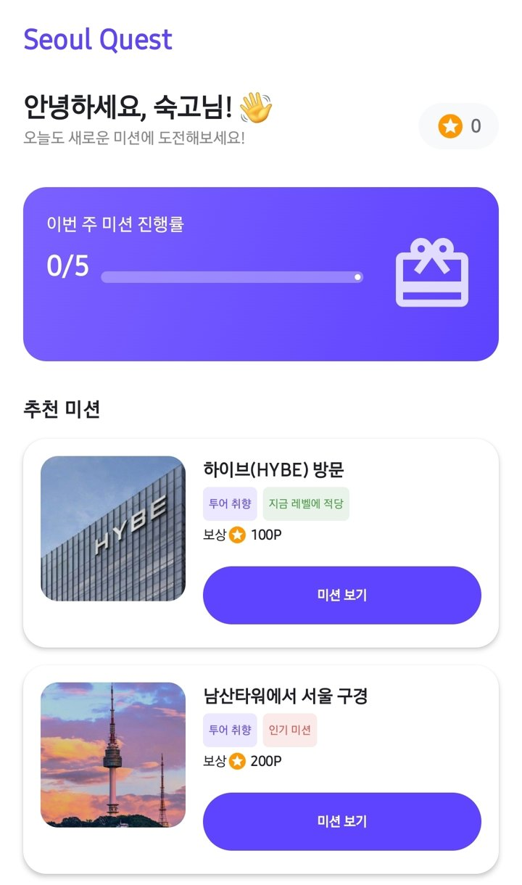
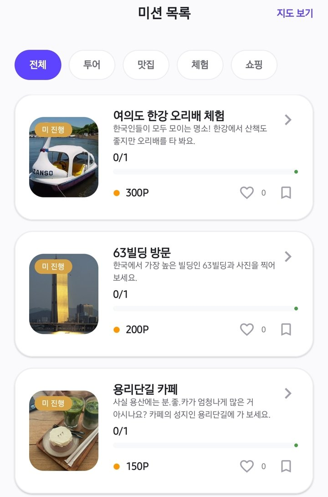
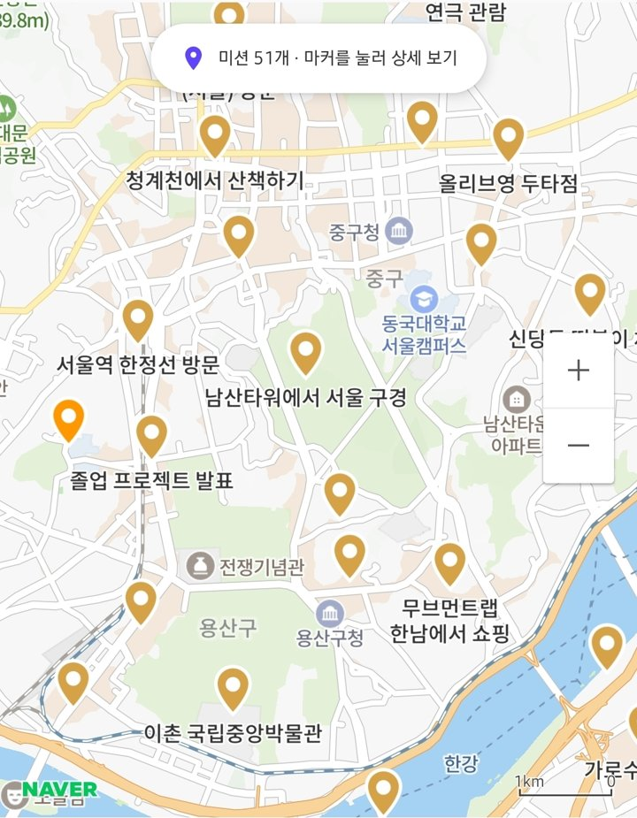
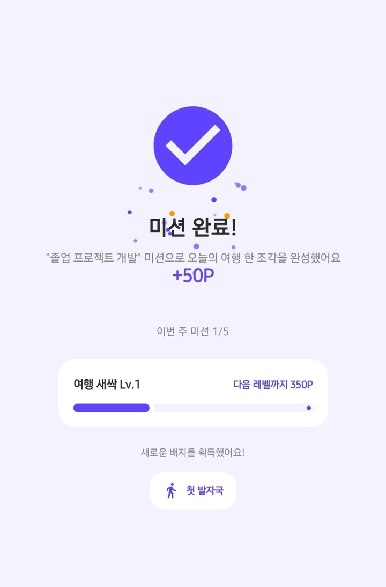
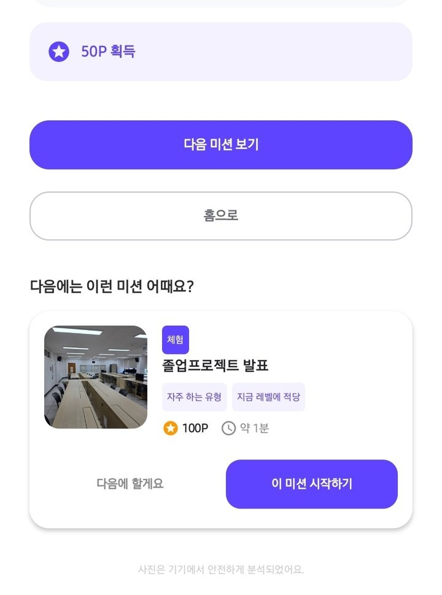
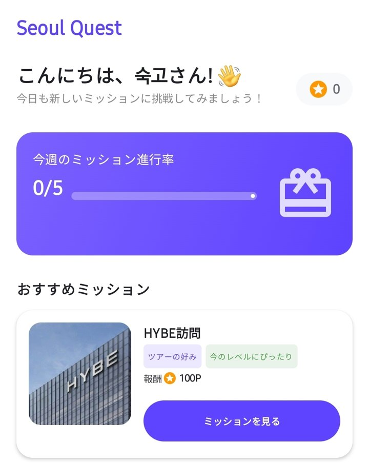
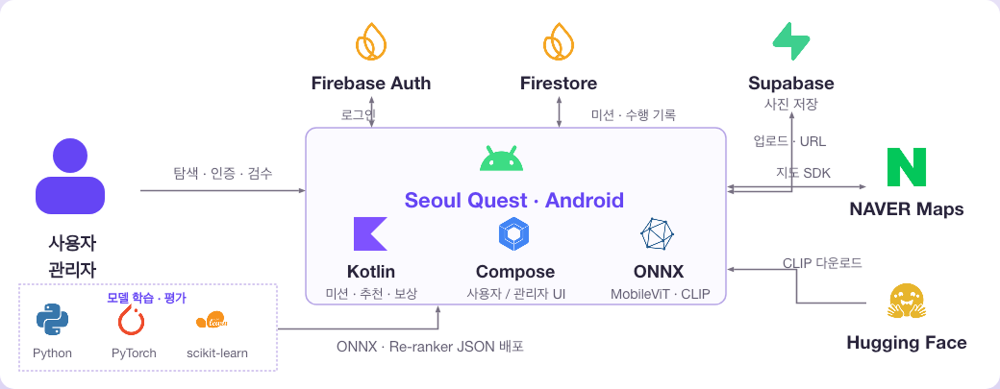

# Seoul Quest

> 서울을 탐험하고, 미션으로 여행을 기록하다.

**Seoul Quest**는 여행지 미션을 수행하고 GPS와 사진으로 인증해 포인트·레벨·배지를 얻는 Android 여행 앱입니다. 여행 취향에 맞는 미션 추천과 지도 탐색, 온디바이스 AI 사진 인증을 연결해 여행의 발견부터 성취까지 하나의 흐름으로 제공합니다.

숙명여자대학교 인공지능공학부 졸업 프로젝트로 개발했습니다.

| 프로젝트 | 정보 |
| --- | --- |
| 개발자 | 김가연 · 강규린 |
| 지도교수 | 김철연 |
| 개발 기간 | 2026.03–2026.09 |
| 플랫폼 | Android 8.0 이상 |
| 지원 언어 | 한국어 · English · 日本語 |

## 앱 다운로드

[**SeoulQuest.apk 내려받기 (v1.0)**](https://github.com/kimgayeon430/seoul-quest/releases/latest/download/SeoulQuest.apk) · [릴리스 페이지](https://github.com/kimgayeon430/seoul-quest/releases/latest)

- Android 8.0(API 26) 이상 기기에서 설치할 수 있으며, 파일 크기는 약 163MB입니다.
- 디버그 서명으로 배포하는 데모 APK입니다. 설치할 때 **출처를 알 수 없는 앱 설치**를 허용해야 하고, Play Protect 경고가 표시될 수 있습니다.
- 위치 인증과 사진 인증을 사용하려면 위치와 카메라 권한을 허용해야 합니다.

## 프로젝트 소개

Seoul Quest는 장소를 둘러보는 여행에 구체적인 활동과 달성 목표를 더합니다. 사용자는 투어·맛집·체험·쇼핑 중 관심 분야를 선택하고, 추천 미션이나 지도에서 다음 목적지를 찾습니다. 현장 방문과 사진 인증을 완료하면 보상을 받으며, 여행 레벨과 배지를 통해 활동을 확인할 수 있습니다.

사진 인증은 기기 내 AI 모델이 먼저 판정하고, 자동 판정이 어려운 경우 관리자 검수로 연결합니다. 사용자가 직접 미션을 제안하고 관리자가 검수하는 기능도 제공해 여행 콘텐츠를 함께 확장할 수 있습니다.

## 서비스 화면

실제 앱 실행 화면입니다. 미션 탐색, 완료 보상, 다음 미션 추천과 일본어 UI를 보여줍니다.

<table>
  <tr>
    <th>홈 · 맞춤 미션 추천</th>
    <th>카테고리별 미션 탐색</th>
    <th>지도에서 여행지 확인</th>
  </tr>
  <tr>
    <td align="center"></td>
    <td align="center"></td>
    <td align="center"></td>
  </tr>
  <tr>
    <th>미션 완료 · 포인트 보상</th>
    <th>다음 미션 추천</th>
    <th>다국어 지원 · 일본어 화면</th>
  </tr>
  <tr>
    <td align="center"></td>
    <td align="center"></td>
    <td align="center"></td>
  </tr>
</table>

## 주요 기능

| 기능 | 설명 |
| --- | --- |
| 개인화 추천 | 여행 취향·완료 이력·거리·난이도·인기도·시간대를 반영한 미션 추천 |
| 미션 탐색 | 카테고리별 목록과 네이버 지도 탐색, 미션 상세·길찾기·진행 상태 확인 |
| GPS·사진 인증 | 목표 장소 반경 200m 이내 위치 인증과 온디바이스 AI 사진 판정 |
| 여행 보상 | 단계별 포인트, 사용자 랭킹, 여행 레벨 5단계와 배지 3종 |
| 다음 미션 추천 | 완료한 미션을 제외하고 다음에 수행할 미션 안내 |
| 참여형 콘텐츠 | 미션 제안·수정·검수 상태 확인, 좋아요와 찜한 미션 관리 |
| 다국어 지원 | 한국어·영어·일본어 UI 전환과 언어별 미션 콘텐츠 표시 |
| 계정 관리 | 회원가입·로그인, 여행 취향 설정, 게스트 둘러보기와 프로필 |

관리자는 미션 등록·수정·삭제, 사진 인증과 미션 제안 검수, 사용자 진행 현황 조회 및 관리자 권한 관리를 수행합니다.

## 서비스 이용 흐름

1. **취향 설정** — 회원가입 후 관심 있는 여행 카테고리를 선택합니다.
2. **미션 선택** — 추천 목록이나 지도에서 미션과 목적지를 확인합니다.
3. **현장 방문** — 목표 지점 반경 200m 이내에서 GPS 위치 인증을 진행합니다.
4. **사진 인증** — 카메라로 촬영한 사진을 확인하고 AI 판정을 받습니다.
5. **보상 확인** — 인증이 완료되면 포인트·레벨·배지를 확인하고 다음 미션을 선택합니다.

### 사진 인증과 완료 처리

| 판정 | 처리 |
| --- | --- |
| 통과 (`PASS`) | 사진 업로드와 데이터 저장 성공 후 미션 완료 및 2단계 보상 지급 |
| 검수 대기 (`NEEDS_REVIEW`) | 사진을 저장하고 관리자 검수 대기. 승인 후 미션 완료 및 2단계 보상 지급 |
| 반려 (`REJECT`) | 사진을 업로드하지 않고 재촬영 안내 |

1단계 위치 인증 보상은 `min(미션 포인트, 100)`, 2단계 보상은 나머지 포인트입니다. 완료·보상 상태를 트랜잭션으로 갱신하고, 재시도와 중복 승인에 따른 중복 지급을 방지합니다.

### 여행 레벨과 배지

| 레벨 | 이름 | 누적 포인트 |
| --- | --- | ---: |
| Lv.1 | 여행 새싹 | 0P |
| Lv.2 | 동네 탐험가 | 500P |
| Lv.3 | 도시 여행자 | 1,500P |
| Lv.4 | 숨은 명소 수집가 | 3,000P |
| Lv.5 | 마스터 트래블러 | 5,000P |

배지는 첫 미션 완료 시 **첫 발자국**, 한 주에 미션 5개 완료 시 **주간 탐험가**, 같은 카테고리의 미션 3개 완료 시 **취향 발견**을 획득합니다. 프로필에서 다음 레벨까지의 진행률과 배지 획득 조건을 확인할 수 있습니다.

## 시스템 구성



Android 앱은 Firebase로 계정과 미션 데이터를 관리하고, Supabase Storage에 인증 사진을 저장합니다. 사진 분류와 참조 이미지 유사도 계산은 ONNX Runtime으로 기기 내에서 수행합니다.

| 구성 요소 | 역할 |
| --- | --- |
| Android · Jetpack Compose | 사용자·관리자 화면, 내비게이션, 카메라와 위치 인증 |
| ViewModel · Repository · Domain | 미션 수행 상태 관리, 외부 서비스 연동, 인증·보상·추천 규칙 분리 |
| Firebase Authentication | 이메일·비밀번호 기반 사용자 인증 |
| Cloud Firestore | 사용자, 미션, 수행 이력, 검수 상태, 포인트 및 반응 데이터 저장 |
| Supabase Storage | 인증 사진·미션 대표 이미지 저장 |
| 네이버 지도 SDK | 미션 위치 마커, 진행 상태와 인증 사진 표시 |
| ONNX Runtime | MobileViT 사진 분류 및 CLIP 이미지 임베딩 추론 |
| Python 학습 파이프라인 | 사진 인증 모델 학습·평가·ONNX 변환, 추천 모델 학습·평가 |

ViewModel·Repository·Domain 분리는 미션 수행 기능에 적용했습니다. 인증·보상·추천의 핵심 규칙은 Firebase에 의존하지 않는 순수 Kotlin으로 구현합니다.

## AI 설계 및 평가

### 온디바이스 사진 인증

`apple/mobilevit-small`을 여행 미션 사진으로 파인튜닝해 **투어·맛집·체험·쇼핑·무효**의 5개 클래스를 분류합니다. 모델은 ONNX 형식으로 앱에 포함하며, 촬영본을 기기에서 분석합니다. 참조 사진과 촬영본의 CLIP 임베딩 유사도를 보조 신호로 사용해 미션 대상과의 일치 여부를 판정에 반영합니다.

| 항목 | 결과 |
| --- | ---: |
| 데이터셋 규모 | 6,063장 |
| 테스트 정확도 | 0.840 |
| 테스트 Macro-F1 | 0.809 |
| CLIP 제로샷 비교 기준 Macro-F1 | 0.627 |
| 무효 사진 Recall · 임계값 0.55 | 0.932 |

위 수치는 공개 데이터와 합성 무효 이미지로 구성한 테스트셋의 평가 결과입니다. 실제 여행 사진의 성능을 보장하는 수치는 아니며, 체험 클래스의 F1은 0.632로 다른 클래스보다 낮습니다. 참조 이미지 유사도 임계값은 공개 장면 데이터 기반의 잠정값입니다.

### 개인화 미션 추천

명시적 취향, 카테고리별 완료 이력, 난이도 적합도, 거리, 인기도, 시간대의 6개 신호를 사용합니다. 홈 화면은 규칙 기반 점수와 로지스틱 회귀 모델의 완료 확률을 결합하고, 카테고리 다양성을 반영해 상위 3개 미션을 선정합니다. 추천 이유도 함께 표시합니다.

| 지표 | 규칙 기반 | 학습 모델 | 하이브리드 · λ=0.6 |
| --- | ---: | ---: | ---: |
| Precision@3 | 0.914 | 0.951 | 0.947 |
| NDCG@5 | 0.914 | 0.953 | 0.947 |
| MAP | 0.873 | 0.904 | 0.899 |

추천 모델은 **합성 사용자·완료 로그**로 학습하고 사용자 단위로 분리한 테스트셋에서 평가했습니다. 실제 서비스 이용자의 추천 만족도나 성과를 측정한 결과는 아닙니다. 미션 완료 화면의 다음 추천은 규칙 기반 점수를 사용합니다.

## 기술 스택

| 영역 | 기술 |
| --- | --- |
| 앱 | Kotlin 2.2.10, Jetpack Compose, Material 3, Navigation Compose |
| 데이터·인증 | Firebase Authentication, Cloud Firestore, Supabase Storage |
| 지도·이미지 | 네이버 지도 SDK 3.23.3, Coil 2.7.0 |
| AI 학습 | Python, PyTorch, Hugging Face, scikit-learn |
| AI 추론 | ONNX Runtime Android 1.29.0, MobileViT-small, CLIP ViT-B/32 |
| 빌드 | Gradle 9.4.1, Android Gradle Plugin 9.2.0, Android SDK 36.1 |
| 검증 | JUnit4, Firebase Emulator, Firestore 규칙 테스트 |

## 프로젝트 구조

```text
app/src/main/
├── java/smu/ai/graduation_project/
│   ├── MainActivity.kt     # 앱 진입과 내비게이션
│   ├── data/               # Repository·외부 서비스·AI 추론
│   ├── domain/             # 인증·보상·추천 규칙
│   ├── model/              # 데이터 모델
│   ├── navigation/         # 화면 경로
│   └── ui/                 # 사용자·관리자 화면과 테마
├── assets/                 # ONNX 사진 분류 모델·추천 모델
└── res/                    # 한국어·영어·일본어 리소스
app/src/test/               # Kotlin 단위 테스트
firestore-tests/            # Firestore 보안 규칙 테스트
ml/                         # 사진 모델 학습·평가·변환
└── reco/                   # 추천 모델 학습·평가
docs/                       # 실행 화면 및 설계·실험 문서
firestore.rules             # 데이터 접근 규칙
```

## 실행 방법

### 준비 환경

- Android Studio, JDK 17 이상, Android SDK 36.1
- Android 8.0(API 26) 이상 기기 또는 에뮬레이터 · `arm64-v8a` / `x86_64`
- Firebase 프로젝트 · Email/Password 인증 및 Cloud Firestore 활성화
- Supabase 프로젝트 · 이미지 저장용 Storage
- 네이버 클라우드 플랫폼 Maps 애플리케이션 및 Client ID

### 프로젝트 설정

```bash
git clone https://github.com/kimgayeon430/seoul-quest.git
cd seoul-quest
```

1. Android Studio에서 프로젝트를 엽니다.
2. Firebase에 패키지 `smu.ai.graduation_project`를 등록하고, 발급받은 `google-services.json`을 `app/`에 배치합니다.
3. Supabase Storage에 공개 버킷 `mission-photos`를 생성하고 앱에서 사용할 업로드 정책을 설정합니다. 프로젝트에서 사용하는 기본 INSERT 정책은 다음과 같습니다.

   ```sql
   create policy "anon upload mission-photos"
   on storage.objects for insert to anon
   with check (bucket_id = 'mission-photos');
   ```

4. 네이버 Maps 애플리케이션에 Android 패키지를 등록합니다.
5. 프로젝트 루트의 `local.properties`에 다음 값을 설정합니다. Android Studio가 작성한 `sdk.dir`은 유지합니다.

   ```properties
   SUPABASE_URL=https://<project>.supabase.co
   SUPABASE_ANON_KEY=<anon-or-publishable-key>
   NAVER_MAP_CLIENT_ID=<maps-client-id>
   ```

6. 저장소의 Firestore 규칙을 대상 Firebase 프로젝트에 배포합니다.

   ```bash
   firebase login
   firebase use <firebase-project-id>
   firebase deploy --only firestore:rules
   ```

   규칙 배포에는 Firebase CLI가 필요합니다.

7. Gradle Sync 후 연결된 기기에서 앱을 실행합니다.

   ```bash
   ./gradlew installDebug
   ```

위치 인증과 촬영 시 위치·카메라 권한을 허용해야 합니다. 사진 분류 모델을 불러오지 못하면 관리자 검수로 연결하며, CLIP 모델은 첫 사용 시 Hugging Face Hub에서 다운로드 후 기기에 캐시합니다.

### 테스트

```bash
./gradlew :app:testDebugUnitTest
```

도메인 규칙 단위 테스트와 Firestore Emulator 테스트로 인증·보상·접근 권한을 검증합니다. 사용자 미션 제안·검수·좋아요·찜 기능은 빌드와 자동 테스트 기준으로 확인했으며, 전체 사용자 흐름의 실기기 검증 범위와는 구분합니다.

## 적용 범위와 확장 방향

졸업 프로젝트의 구현 범위는 여행 미션 탐색·인증·보상, 개인화 추천, 다국어 UI와 관리자 검수입니다. 서비스 운영 단계에서는 실제 여행 사진과 이용 로그를 통한 모델 보정, 서버 측 포인트·보상 검증, 위치 조작 탐지와 사용자 흐름 테스트 확대가 필요합니다.

## 관련 문서

- [설계 및 실험 기록](docs/report.md)
- [사진 인증 모델과 학습 파이프라인](ml/README.md)
- [추천 모델과 평가 방법](ml/reco/README.md)
- [사진 인증 평가 설정](ml/thresholds.json)
